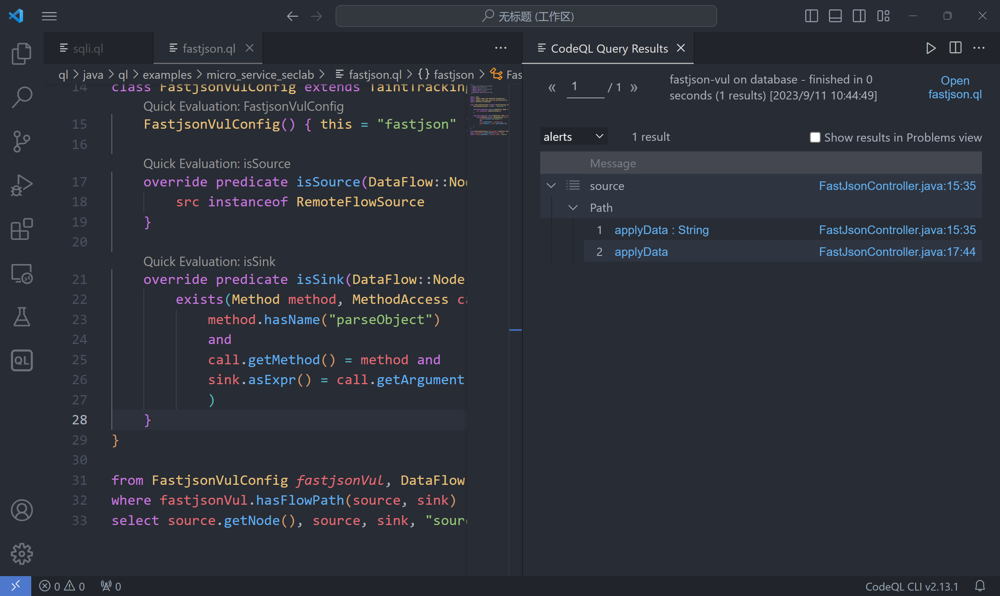
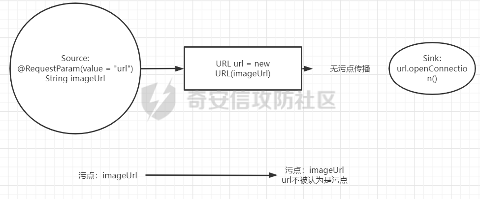
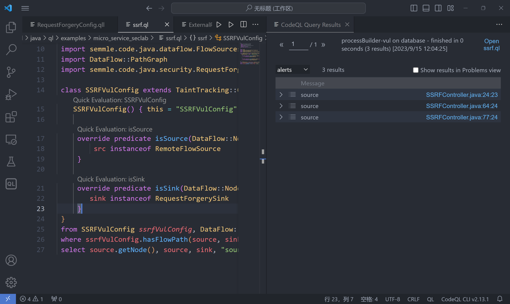
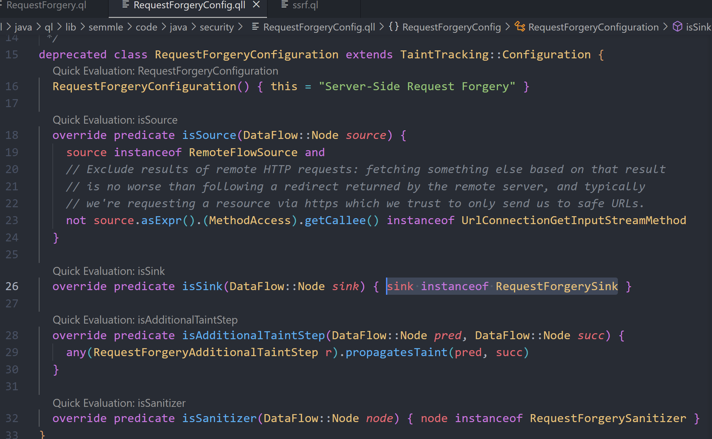
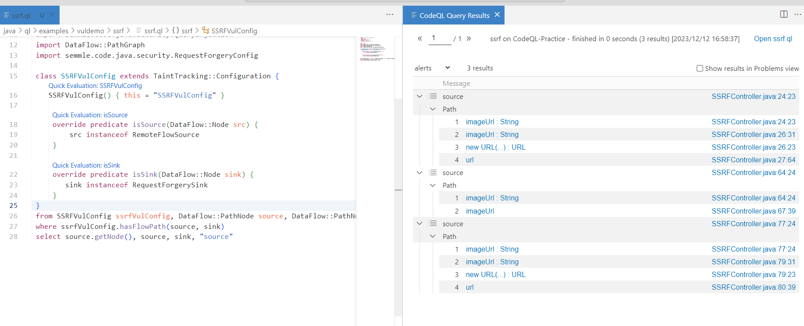
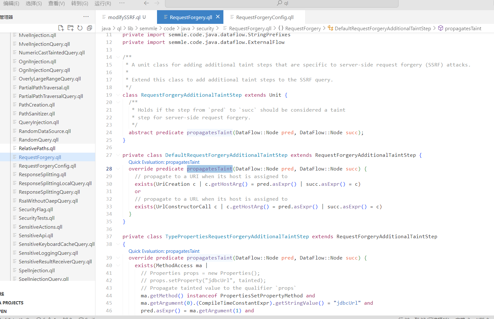
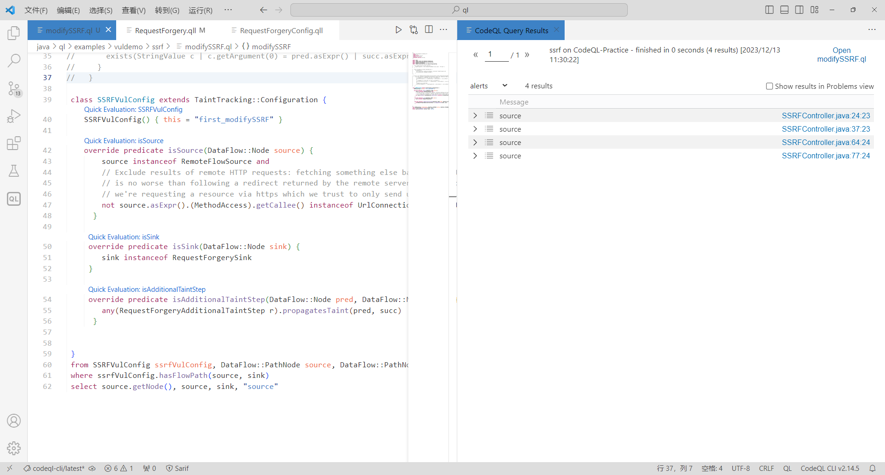
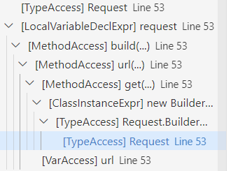
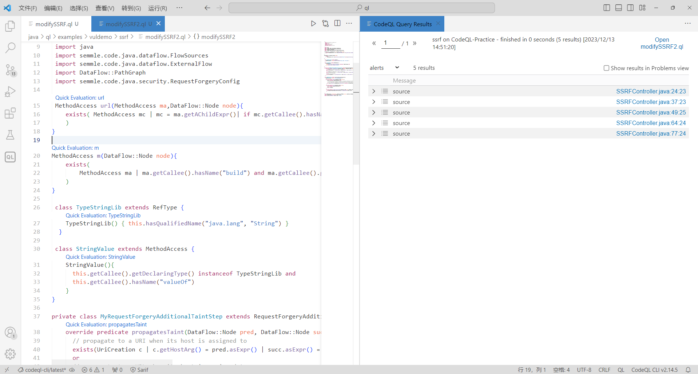
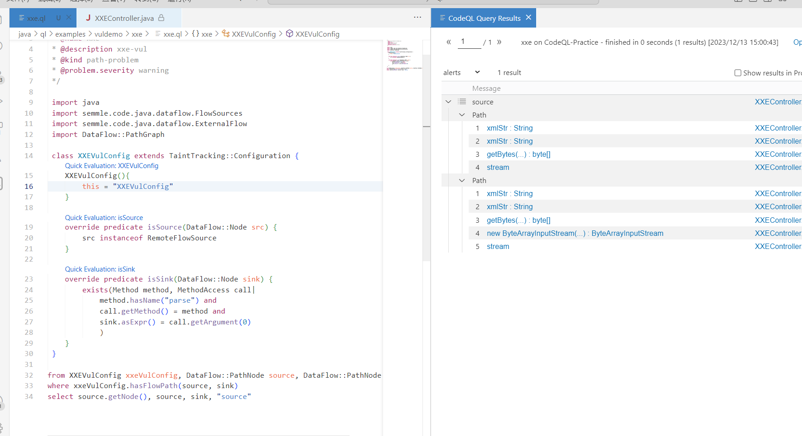

##  关于其他漏洞点的 CodeQL 语句尝试

### Fastjson

依样画葫芦

```ql
/**
 * @id java/examples/vuldemo
 * @name fastjson-vul
 * @description fastjson-vul
 * @kind path-problem
 * @problem.severity warning
 */

import java
import semmle.code.java.dataflow.FlowSources
import semmle.code.java.security.QueryInjection
import DataFlow::PathGraph

class FastjsonVulConfig extends TaintTracking::Configuration {
    FastjsonVulConfig() { this = "fastjson" }
    
    override predicate isSource(DataFlow::Node src) {
        src instanceof RemoteFlowSource
    }
    
    override predicate isSink(DataFlow::Node sink) {
        exists(Method method, MethodAccess call|
            method.hasName("parseObject")
            and
            call.getMethod() = method and
            sink.asExpr() = call.getArgument(0)
            )
    }
}

from FastjsonVulConfig fastjsonVul, DataFlow::PathNode source, DataFlow::PathNode sink
where fastjsonVul.hasFlowPath(source, sink)
select source.getNode(), source, sink, "source"
```



### 命令执行

写了我一会儿，经过查阅资料发现有直接现成的。

```ql
/**
 * @id java/examples/vuldemo
 * @name processBuilder-vul
 * @description processBuilder-vul
 * @kind path-problem
 * @problem.severity warning
 */

 import java
 import semmle.code.java.dataflow.FlowSources
 import DataFlow::PathGraph

 class RceVulConfig extends TaintTracking::Configuration {
     RceVulConfig() { this = "RceVulConfig" }
     
     override predicate isSource(DataFlow::Node src) {
         src instanceof RemoteFlowSource
     }
     
     override predicate isSink(DataFlow::Node sink) {
        sink.asExpr() instanceof ArgumentToExec
     }
 }
 from RceVulConfig rceVulConfig, DataFlow::PathNode source, DataFlow::PathNode sink
 where rceVulConfig.hasFlowPath(source, sink)
 select source.getNode(), source, sink, "source"
```

### SSRF（重点关注）

这里的内容主要是参考于这篇文章 https://forum.butian.net/share/2117
### 老版本中的表现

还是觉得关于 SSRF 的 ql 规则这块儿，应该再记录一下，其实在之前看命令执行的 sink 的时候就没追踪到，但是那个时候并没有深入去看。

最开始我的 ql 语句是这样的~~（很嫩的 ql 语句）~~

```ql
override predicate isSource(DataFlow::Node src) {
         src instanceof RemoteFlowSource
     }
     
     override predicate isSink(DataFlow::Node sink) {
         exists(Method method, MethodAccess call|
             method.hasName("openConnection")
             and
             call.getMethod() = method and
             sink.asExpr() = call.getArgument(0)
             )
     }
```

追踪 `url.openConnection()`，但这很明显是追踪不到的，因为 `url.openConnection()` 是不传参的。那么这一条链路用图来表示的话，断在了这里



那么中间断的地方我们要想办法接上，这就回到了前文提到过的 `isAdditionalTaintStep` 方法。从应用角度来说代码应该如下

```ql
/**
 * @id java/examples/vuldemo
 * @name processBuilder-vul
 * @description processBuilder-vul
 * @kind path-problem
 * @problem.severity warning
 */

 import java
 import semmle.code.java.dataflow.FlowSources
 import semmle.code.java.security.QueryInjection
 import DataFlow::PathGraph
 import semmle.code.java.security.RequestForgeryConfig
 
 class SSRFVulConfig extends TaintTracking::Configuration {
    SSRFVulConfig() { this = "SSRFVulConfig" }
     
     override predicate isSource(DataFlow::Node src) {
         src instanceof RemoteFlowSource
     }
     
     override predicate isSink(DataFlow::Node sink) {
        sink instanceof RequestForgerySink
     }
 }
 from SSRFVulConfig ssrfVulConfig, DataFlow::PathNode source, DataFlow::PathNode sink
 where ssrfVulConfig.hasFlowPath(source, sink)
 select source.getNode(), source, sink, "source"
```

运行结果



此处 import 了一个新的文件 `semmle.code.java.security.RequestForgeryConfig`，这里匹配了对应的规则，和之前的命令执行接口是一样的。可以深入看一下对应的实现。



### 新版本中的表现

#### 漏报处理一

新版本这里的判断规则是不一样的，删除了 SinkModelCsv 这一功能，这也就导致了我原本在看 SSRF 漏洞的时候，跟错了一些代码。我先贴一下我的 ql 语句

```ql
/**
 * @id java/examples/vuldemo/ssrf
 * @name ssrf
 * @description ssf-vul
 * @kind path-problem
 * @problem.severity warning
 */

 import java
 import semmle.code.java.dataflow.FlowSources
 import semmle.code.java.security.QueryInjection
 import DataFlow::PathGraph
 import semmle.code.java.security.RequestForgeryConfig
 
 class SSRFVulConfig extends TaintTracking::Configuration {
    SSRFVulConfig() { this = "SSRFVulConfig" }
     
     override predicate isSource(DataFlow::Node src) {
         src instanceof RemoteFlowSource
     }
     
     override predicate isSink(DataFlow::Node sink) {
        sink instanceof RequestForgerySink
     }
 }
 from SSRFVulConfig ssrfVulConfig, DataFlow::PathNode source, DataFlow::PathNode sink
 where ssrfVulConfig.hasFlowPath(source, sink)
 select source.getNode(), source, sink, "source"
```

经过调试，发现 source 和 sink 都是可以获取到全部的，并没有漏报，但是运行 ql 语句的结果只能拿到三条



其中没有捕获到的是 `two`，`three` 这两个接口

先来看 `two` 这个接口怎么处理

该漏洞的触发流程如下：

`imageUrl→url = new URL(imageUrl)→String.valueOf(url)→Request.Get(String.valueOf(url))`

在 `two` 接口中的代码有问题的地方如下，用到了 `String.valueOf(url)`

```java
HttpResponse response = Request.Get(String.valueOf(url)).execute().returnResponse();
```

正常情况下程序不会觉得 `String.valueOf()` 方法返回的仍然是污点。因此我们需要修改 Config 中的 `isAdditionalTaintStep` 方法，将 `java.net.URL` 和 `String.valueOf(url)` 绑定。

跟进 `RequestForgeryConfig` 看一下新版本当中是怎么进行漏报处理的，核心代码

```ql
override predicate isAdditionalTaintStep(DataFlow::Node pred, DataFlow::Node succ) {
    any(RequestForgeryAdditionalTaintStep r).propagatesTaint(pred, succ)
  }
```

跟进 `RequestForgeryAdditionalTaintStep.propagatesTaint`



明显看到此处是没有对 `String.ValueOf()` 进行处理的，那么这里就需要我们自己定义一个类，在继承 `RequestForgeryAdditionalTaintStep` 类的基础上重写一下对应的检测规则。（因为抽象类 `abstract class` 会调用所有的子类）

此处我们应该先构造一个 `String.ValueOf()`，代码如下

```ql
 class TypeStringLib extends RefType {
    TypeStringLib() { this.hasQualifiedName("java.lang", "String") }
  }

 class StringValue extends MethodAccess {
    StringValue(){
      this.getCallee().getDeclaringType() instanceof TypeStringLib and
      this.getCallee().hasName("valueOf")
    }
}
```

接着再来处理 `String.valueOf(URL)`，判断 `String.valueOf(url)→Request.Get(String.valueOf(url))` 是污点

```ql
exists(StringValue c | c.getArgument(0) = pred.asExpr() | succ.asExpr() = c)
```

如此一来就可以解决问题了，在具体实现上可以直接魔改 RequestForgeryAdditionalTaintStep.qll 文件，如果魔改则文件如下

**RequestForgery.qll**

```ql
/** Provides classes to reason about server-side request forgery (SSRF) attacks. */

import java
import semmle.code.java.frameworks.Networking
import semmle.code.java.frameworks.ApacheHttp
import semmle.code.java.frameworks.spring.Spring
import semmle.code.java.frameworks.JaxWS
import semmle.code.java.frameworks.javase.Http
import semmle.code.java.dataflow.DataFlow
import semmle.code.java.frameworks.Properties
private import semmle.code.java.dataflow.StringPrefixes
private import semmle.code.java.dataflow.ExternalFlow

 class TypeStringLib extends RefType {
    TypeStringLib() { this.hasQualifiedName("java.lang", "String") }
  }

 class StringValue extends MethodAccess {
    StringValue(){
      this.getCallee().getDeclaringType() instanceof TypeStringLib and
      this.getCallee().hasName("valueOf")
    }
}

/**
 * A unit class for adding additional taint steps that are specific to server-side request forgery (SSRF) attacks.
 *
 * Extend this class to add additional taint steps to the SSRF query.
 */
class RequestForgeryAdditionalTaintStep extends Unit {
  /**
   * Holds if the step from `pred` to `succ` should be considered a taint
   * step for server-side request forgery.
   */
  abstract predicate propagatesTaint(DataFlow::Node pred, DataFlow::Node succ);
}

private class DefaultRequestForgeryAdditionalTaintStep extends RequestForgeryAdditionalTaintStep {
  override predicate propagatesTaint(DataFlow::Node pred, DataFlow::Node succ) {
    // propagate to a URI when its host is assigned to
    exists(UriCreation c | c.getHostArg() = pred.asExpr() | succ.asExpr() = c)
    or
    // propagate to a URL when its host is assigned to
    exists(UrlConstructorCall c | c.getHostArg() = pred.asExpr() | succ.asExpr() = c)
    or 
      //处理String.valueOf(URL)
    exists(StringValue c | c.getArgument(0) = pred.asExpr() | succ.asExpr() = c)
  }
}

private class TypePropertiesRequestForgeryAdditionalTaintStep extends RequestForgeryAdditionalTaintStep
{
  override predicate propagatesTaint(DataFlow::Node pred, DataFlow::Node succ) {
    exists(MethodAccess ma |
      // Properties props = new Properties();
      // props.setProperty("jdbcUrl", tainted);
      // Propagate tainted value to the qualifier `props`
      ma.getMethod() instanceof PropertiesSetPropertyMethod and
      ma.getArgument(0).(CompileTimeConstantExpr).getStringValue() = "jdbcUrl" and
      pred.asExpr() = ma.getArgument(1) and
      succ.asExpr() = ma.getQualifier()
    )
  }
}

/** A data flow sink for server-side request forgery (SSRF) vulnerabilities. */
abstract class RequestForgerySink extends DataFlow::Node { }

private class DefaultRequestForgerySink extends RequestForgerySink {
  DefaultRequestForgerySink() { sinkNode(this, "request-forgery") }
}

/** A sanitizer for request forgery vulnerabilities. */
abstract class RequestForgerySanitizer extends DataFlow::Node { }

private class PrimitiveSanitizer extends RequestForgerySanitizer {
  PrimitiveSanitizer() {
    this.getType() instanceof PrimitiveType or
    this.getType() instanceof BoxedType or
    this.getType() instanceof NumberType
  }
}

private class HostnameSanitizingPrefix extends InterestingPrefix {
  int offset;

  HostnameSanitizingPrefix() {
    // Matches strings that look like when prepended to untrusted input, they will restrict
    // the host or entity addressed: for example, anything containing `?` or `#`, or a slash that
    // doesn't appear to be a protocol specifier (e.g. `http://` is not sanitizing), or specifically
    // the string "/".
    exists(this.getStringValue().regexpFind("([?#]|[^?#:/\\\\][/\\\\])|^/$", 0, offset))
  }

  override int getOffset() { result = offset }
}

/**
 * A value that is the result of prepending a string that prevents any value from controlling the
 * host of a URL.
 */
private class HostnameSantizer extends RequestForgerySanitizer {
  HostnameSantizer() { this.asExpr() = any(HostnameSanitizingPrefix hsp).getAnAppendedExpression() }
}

```

是可以成功捕获到 two 接口的



如果你不想破坏 ql 原本的语法，也可以更改自己的查询类

**modifySSRF.ql**

```ql
/**
 * @id java/examples/vuldemo/ssrf
 * @name ssrf
 * @description ssf-vul
 * @kind path-problem
 * @problem.severity warning
 */

 import java
 import semmle.code.java.dataflow.FlowSources
 import semmle.code.java.dataflow.ExternalFlow
 import DataFlow::PathGraph
 import semmle.code.java.security.RequestForgeryConfig
 
 class TypeStringLib extends RefType {
    TypeStringLib() { this.hasQualifiedName("java.lang", "String") }
  }

 class StringValue extends MethodAccess {
    StringValue(){
      this.getCallee().getDeclaringType() instanceof TypeStringLib and
      this.getCallee().hasName("valueOf")
    }
}

private class MyRequestForgeryAdditionalTaintStep extends RequestForgeryAdditionalTaintStep {
    override predicate propagatesTaint(DataFlow::Node pred, DataFlow::Node succ) {
      // propagate to a URI when its host is assigned to
      exists(UriCreation c | c.getHostArg() = pred.asExpr() | succ.asExpr() = c)
      or
      // propagate to a URL when its host is assigned to
      exists(UrlConstructorCall c | c.getHostArg() = pred.asExpr() | succ.asExpr() = c)
      or 
      //处理String.valueOf(URL)
      exists(StringValue c | c.getArgument(0) = pred.asExpr() | succ.asExpr() = c)
    }
  }

 class SSRFVulConfig extends TaintTracking::Configuration {
    SSRFVulConfig() { this = "first_modifySSRF" }
     
    override predicate isSource(DataFlow::Node source) {
        source instanceof RemoteFlowSource and
        // Exclude results of remote HTTP requests: fetching something else based on that result
        // is no worse than following a redirect returned by the remote server, and typically
        // we're requesting a resource via https which we trust to only send us to safe URLs.
        not source.asExpr().(MethodAccess).getCallee() instanceof UrlConnectionGetInputStreamMethod
      }
     
     override predicate isSink(DataFlow::Node sink) {
        sink instanceof RequestForgerySink
     }

     override predicate isAdditionalTaintStep(DataFlow::Node pred, DataFlow::Node succ) {
        any(RequestForgeryAdditionalTaintStep r).propagatesTaint(pred, succ)
      }


 }
 from SSRFVulConfig ssrfVulConfig, DataFlow::PathNode source, DataFlow::PathNode sink
 where ssrfVulConfig.hasFlowPath(source, sink)
 select source.getNode(), source, sink, "source"
```

同样是可以捕获到的

#### 漏报处理二

漏洞代码如下：

```java
@RequestMapping(value = "/three")
public String Three(@RequestParam(value = "url") String imageUrl) {
    try {
        URL url = new URL(imageUrl);
        OkHttpClient client = new OkHttpClient();
        com.squareup.okhttp.Request request = new com.squareup.okhttp.Request.Builder().get().url(url).build();
        Call call = client.newCall(request);
        Response response = call.execute();
        return response.toString();
    } catch (IOException var1) {
        System.out.println(var1);
        return "Hello";
    }
}
```

这种方式使用了 Okhttp 发起 HTTP 请求，okhttp 是链式调用，常见的请求代码写法如下：

```java
new com.squareup.okhttp.Request.Builder().xxx.xxx.xxx.url(url).xxx.build()
```

这种请求相对更复杂，因此需要自行构造规则。在这一条 ql 的语句当中有两个关键的定位锚点，一个是`url(url)`，一个是 `build()`，`url()` 确定是否引入污点，`build()` 确定sink的位置。结合这两者，进行检测 ql 的构造。

首先观察这种结构的语法树



这种链式结构调用在语法树中是包含的关系，当获取到最外层的 MethodAccess 时，可以使用 `getAChildExpr()` 方法返回其子语句，使用 `getAChildExpr+()` 可以递归返回全部子语句。结合前面说到的两个关键定位锚点，进行如下代码构造

```ql
MethodAccess url(MethodAccess ma,DataFlow::Node node){
    exists( MethodAccess mc | mc = ma.getAChildExpr()| if mc.getCallee().hasName("url") and mc.getArgument(0) = node.asExpr() then result = mc else result = url(mc,node)
    )
}

MethodAccess m(DataFlow::Node node){
    exists(
        MethodAccess ma | ma.getCallee().hasName("build") and ma.getCallee().getDeclaringType().hasName("Builder") |result = url(ma,node)
    )
}
```

接着在 `isSink()` 里面调用它即可。最后的完整代码

**modifySSRF2.ql**

```ql
/**
 * @id java/examples/vuldemo/ssrf
 * @name ssrf
 * @description ssf-vul
 * @kind path-problem
 * @problem.severity warning
 */

 import java
 import semmle.code.java.dataflow.FlowSources
 import semmle.code.java.dataflow.ExternalFlow
 import DataFlow::PathGraph
 import semmle.code.java.security.RequestForgeryConfig
 
 MethodAccess url(MethodAccess ma,DataFlow::Node node){
    exists( MethodAccess mc | mc = ma.getAChildExpr()| if mc.getCallee().hasName("url") and mc.getArgument(0) = node.asExpr() then result = mc else result = url(mc,node)
    )
}

MethodAccess m(DataFlow::Node node){
    exists(
        MethodAccess ma | ma.getCallee().hasName("build") and ma.getCallee().getDeclaringType().hasName("Builder") |result = url(ma,node)
    )
}

 class TypeStringLib extends RefType {
    TypeStringLib() { this.hasQualifiedName("java.lang", "String") }
  }

 class StringValue extends MethodAccess {
    StringValue(){
      this.getCallee().getDeclaringType() instanceof TypeStringLib and
      this.getCallee().hasName("valueOf")
    }
}

private class MyRequestForgeryAdditionalTaintStep extends RequestForgeryAdditionalTaintStep {
    override predicate propagatesTaint(DataFlow::Node pred, DataFlow::Node succ) {
      // propagate to a URI when its host is assigned to
      exists(UriCreation c | c.getHostArg() = pred.asExpr() | succ.asExpr() = c)
      or
      // propagate to a URL when its host is assigned to
      exists(UrlConstructorCall c | c.getHostArg() = pred.asExpr() | succ.asExpr() = c)
      or 
      //处理String.valueOf(URL)
      exists(StringValue c | c.getArgument(0) = pred.asExpr() | succ.asExpr() = c)
    }
  }

 class SSRFVulConfig extends TaintTracking::Configuration {
    SSRFVulConfig() { this = "first_modifySSRF" }
     
    override predicate isSource(DataFlow::Node source) {
        source instanceof RemoteFlowSource and
        // Exclude results of remote HTTP requests: fetching something else based on that result
        // is no worse than following a redirect returned by the remote server, and typically
        // we're requesting a resource via https which we trust to only send us to safe URLs.
        not source.asExpr().(MethodAccess).getCallee() instanceof UrlConnectionGetInputStreamMethod
      }
     
     override predicate isSink(DataFlow::Node sink) {
        sink instanceof RequestForgerySink or  
        //sink = URL对象
        exists (m(sink))
     }

     override predicate isAdditionalTaintStep(DataFlow::Node pred, DataFlow::Node succ) {
        any(RequestForgeryAdditionalTaintStep r).propagatesTaint(pred, succ)
      }


 }
 from SSRFVulConfig ssrfVulConfig, DataFlow::PathNode source, DataFlow::PathNode sink
 where ssrfVulConfig.hasFlowPath(source, sink)
 select source.getNode(), source, sink, "source"
```



### XXE

用最简单的语句就可以抓到了

```ql
/**
 * @id java/examples/vuldemo/xxe
 * @name xxe
 * @description xxe-vul
 * @kind path-problem
 * @problem.severity warning
 */

 import java
 import semmle.code.java.dataflow.FlowSources
 import semmle.code.java.dataflow.ExternalFlow
 import DataFlow::PathGraph

 class XXEVulConfig extends TaintTracking::Configuration {
    XXEVulConfig(){
        this = "XXEVulConfig"
    }

    override predicate isSource(DataFlow::Node src) {
        src instanceof RemoteFlowSource
    }

    override predicate isSink(DataFlow::Node sink) {
        exists(Method method, MethodAccess call|
            method.hasName("parse") and
            call.getMethod() = method and
            sink.asExpr() = call.getArgument(0)
            )
    }
 }

from XXEVulConfig xxeVulConfig, DataFlow::PathNode source, DataFlow::PathNode sink
where xxeVulConfig.hasFlowPath(source, sink)
select source.getNode(), source, sink, "source"
```



## 后记

初学 CodeQL 所练习的一些规则，我认为我自己写的一些内容并不准备，大部分内容也是拾人牙慧，如有写的不准确的地方还请师傅们多多指点。